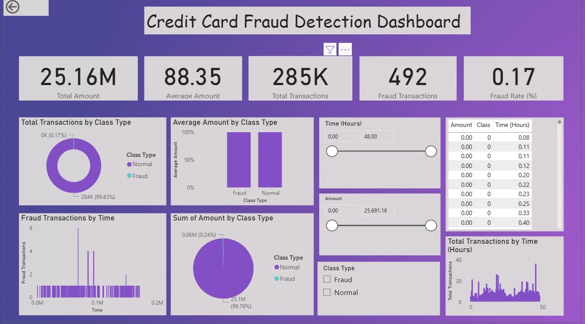

# 💳 Credit Card Fraud Analysis & Detection Dashboard

## 📊 Project Overview

This project presents an interactive Power BI dashboard for analyzing credit card transactions and detecting fraudulent activities.

## 🎯 Objectives

* Identify fraud patterns in transaction data
* Analyze transaction amounts and trends
* Explore time-based fraud behavior

## 📂 Access Full Project Files

The dataset and Power BI (.pbix) file are available via cloud storage due to GitHub size limitations.

👉 **Google Drive Folder:**
https://drive.google.com/drive/folders/1I7VVTcgfovn8LRTjLziOXaPA643Y6it4?usp=sharing

## 📌 Contents

* Power BI Dashboard File (.pbix)
* Processed Fraud Dataset

📓 Jupyter Notebook Analysis

👉 View Data Analysis Notebook(creditcard_fraud.ipnyb)

This notebook includes:

Data preprocessing
Exploratory Data Analysis (EDA)
Fraud pattern insights

## 📁 Dataset

* Contains 284,807 transactions
* Highly imbalanced dataset
* Fraud cases: 492 (~0.17%)

## 📌 Key Features

* Fraud vs Normal distribution
* Transaction trends over time
* Amount-based analysis
* Interactive slicers (Transaction Type, Amount, Time)

## 📸 Dashboard Preview

## 🛠 Tools Used

* Power BI
* DAX
* Data Visualization

## 📈 Key Insights

* Fraud transactions are extremely rare
* Certain time periods show spikes in fraud
* Fraud patterns differ from normal transactions

## 🚀 How to Use

1. Download the `.pbix` file
2. Open in Power BI Desktop
3. Explore using slicers and visuals

---

## 👩‍💻 Author

Samadhi Jayasundara
